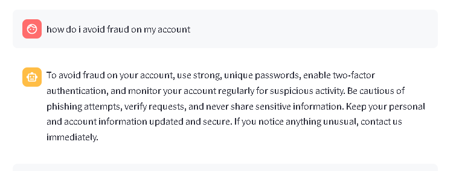
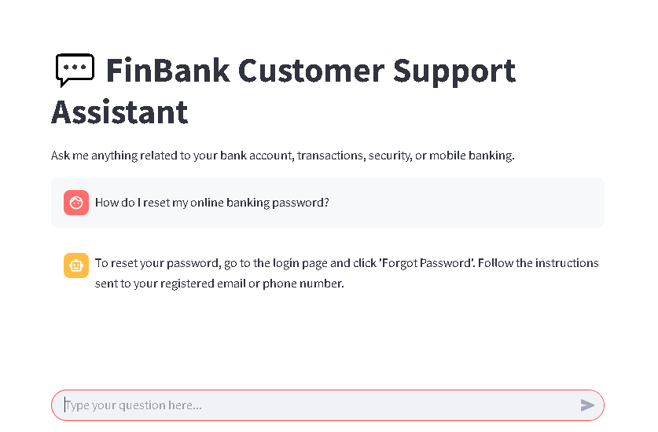

#  Customer Support Assistant

An AI-powered chatbot that assists users by answering frequently asked questions (FAQs) and generating responses for more complex queries using a Language Model (LLM). Features both a **Streamlit web interface** and **CLI programmatic access**.

---

##  Project Structure

```
.
├── llm.py               # Main assistant logic (CLI + programmatic support)
├── utils.py             # FAQ helpers and matching logic
├── streamlit_app.py     # Streamlit web UI
├── chat_history.json    # Persistent chat memory
├── faq_data.json        # Predefined FAQs
├── .env                 # Stores API key securely
├── tests/               # Unit tests and mock data
└── README.md            # Project documentation (this file)
```

---

##  Features

-  Fast FAQ matching from a predefined knowledge base
-  LLM-based dynamic responses for complex queries
-  Persistent chat history via JSON
-  Web-based UI with Streamlit
-  Pytest-based testing framework
-  Supports both interactive CLI and programmatic access

---

##  Screenshots

> Add your screenshots to a `screenshots/` folder and use these placeholders.

###  Streamlit Chatbot UI

  
*Fig: Example showing how the assistant handles a fraud case inquiry.*

  
*Fig: Response matched from `faq_data.json`.*

---

##  Setup Instructions

1. **Clone the repository**:

```bash
git clone https://github.com/Data-Epic/Oluwafemi-Olajide-llm-api.git
cd Customer_Service
```

2. **Add your API key** to a `.env` file:

```env
GROQ_API_KEY=your-api-key-here
```

---

##  How to Run

### ▶️ Web Interface (Streamlit)

```bash
streamlit run streamlit_app.py
```

###  CLI Assistant

You can also chat with the assistant directly in the terminal:

```bash
python llm.py
```

You'll see a welcome prompt and can start chatting. Type `exit` to quit or `clear` to reset the session.

---

##  Programmatic Access

You can import and use the assistant in your own Python code:

```python
from llm import CustomerSupportAssistant

assistant = CustomerSupportAssistant(api_key="your-key")
response = assistant.get_response("How do I reset my password?")
print(response)
```

---

##  Example CLI Chat

```bash
Welcome to your Banking Support Assistant (CLI)
Type 'exit' to quit or 'clear' to reset chat history.

You: How do I check my balance?
Assistant: You can check your balance through the app dashboard.

You: What is my last transaction?
Assistant: This is a reply will come from the model.
```

---

##  Running Tests

Run all tests with:

```bash
pytest tests/
```

---

##  Limitations & Future Improvements

-  Exact match logic only; fuzzy matching can be improved
-  No support for file uploads as FAQs yet
-  No multilingual or voice support (coming soon)
-  Lacks deep user memory and personalization

---

##  License

MIT License – fork, modify, and contribute freely.

---

##  Acknowledgements

- Thanks to **Groq** for LLM services  
- Built with using **Python** and **Streamlit**  
- **DataEpic** for the enlightment for a project like this
